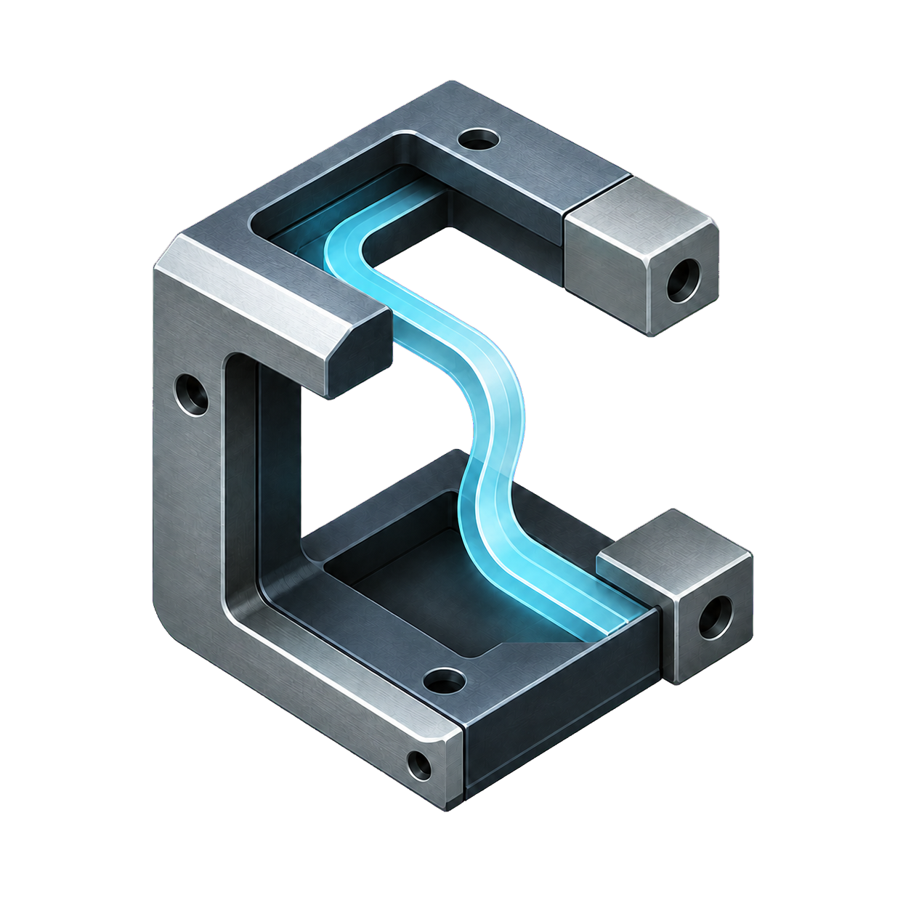
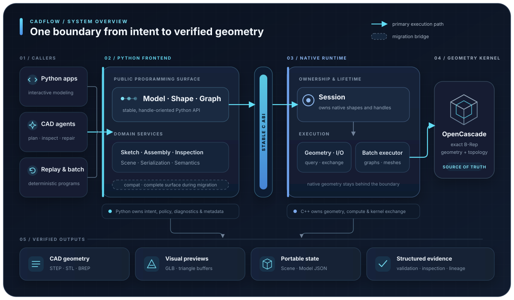

<p align="center">
  
</p>

<h1 align="center">CadFlow</h1>

<p align="center">
  <strong>CAD infrastructure for agents</strong>
</p>

<p align="center">
  An Agentic CAD Infra framework for building programmable geometry and obtaining structured feedback
</p>

<p align="center">
  <a href="https://www.python.org/"></a>
  
  
  
  <a href="http://119.28.82.252/"></a>
  <a href="LICENSE"></a>
  
</p>

<p align="center">
  <a href="README.md">English</a> ·
  <a href="README_zh.md">简体中文</a>
</p>

<p align="center">
  <a href="#-why-cadflow">🧭 Why CadFlow</a> ·
  <a href="#-quick-start">🚀 Quick start</a> ·
  <a href="#-capabilities">🧰 Capabilities</a> ·
  <a href="#roadmap">🗺️ Roadmap</a> ·
  <a href="#-architecture">🏗️ Architecture</a> ·
  <a href="#-agent-workflows">🤖 Agent workflows</a>
</p>

---

CadFlow is a CAD SDK for **programmatic modeling and geometry-grounded agents**. CadFlow is not a text-to-3D model or an LLM application. It is the deterministic Agentic CAD Infra beneath those systems: Python programs and agents describe modeling intent; CadFlow builds and measures the geometry, then returns actionable facts to the caller.

## 🧭 Why CadFlow

### A CAD boundary designed for agents

`Shape.describe()`, `Shape.validate()`, `Model.capabilities()`, `Model.preflight()`, and `Model.apply()` return structured, JSON-safe reports. An agent can reason about operation support, invalid topology, solid count, bounds, volume, and recovery hints instead of scraping arbitrary console output.

### Native geometry without leaking kernel objects

Python sees lightweight `(session_token, shape_id)` handles—not `TopoDS_Shape` instances crossing an ABI boundary. The C++ session owns geometry and performs expensive construction, boolean, tessellation, measurement, and exchange work close to OpenCascade.

### Editable and replayable engineering state

CadFlow supports direct session modeling, typed batch graphs, replayable Model JSON, semantic tags, source mapping, and lineage. The result remains inspectable Python and structured data rather than an opaque mesh-generation step.

### One path from model to artifact

The same package covers construction, topology inspection, BREP comparison, STEP/STL exchange, GLB preview, assemblies, and validated Scene archives. Modeling and delivery share the same geometry source of truth.

## 🚀 Quick start

```python
import cadflow as cad


with cad.Model() as model:
    plate = model.box(80, 50, 8)

    bore = model.cylinder(radius=6, height=12)
    bore = model.translate(bore, 20, 25, -2)
    part = model.cut(plate, bore)

    report = part.validate()
    if not report.ok:
        raise RuntimeError(report.to_dict())

    print(part.describe())
    part.export_step("mounting_plate.step")
    part.export_preview_glb("mounting_plate.glb")
```

`cadflow.Model` owns the native session, and every returned `cadflow.Shape` belongs to that session. The final shape can be queried, validated, tessellated, or exported without exposing OpenCascade objects to application code.

Use the API layer that matches the workflow:

| API | Best for |
| --- | --- |
| `cadflow.Model` / `cadflow.Shape` | Interactive construction, inspection, and export |
| `cadflow.Graph` | Typed multi-operation plans executed through one native call |
| Domain modules | Sketching, assemblies, Scene archives, serialization, inspection, and standard parts |
| `cadflow.compat` | The complete compatibility surface while native migration continues |

New integrations should begin with `cadflow.Model` or `cadflow.Graph` and use public domain modules for higher-level workflows.

## 🧰 Capabilities

| Area | Current scope |
| --- | --- |
| Solid modeling | Box, cylinder, sphere, cone, profiles, faces, extrude, revolve, loft, sweep, fillet, chamfer, and shell |
| Geometry operations | Exact OCCT booleans, rigid transforms, scale, sewing, shell-to-solid conversion, and subshape extraction |
| Curves and surfaces | Lines, arcs, splines, helices, Bezier surfaces, fitted B-spline surfaces, ruled/filling/Gordon surfaces, and twisted sweeps |
| Sketch and context | Immutable coordinate frames, workplanes, declarative sketches, constraints, and `py-slvs` solving |
| Inspection | Volume, area, length, center of mass, distance, bounds, topology counts, normals, curvature, free boundaries, and BREP comparison |
| Exchange and preview | STEP import/export, BREP/STL import, STL export, native mesh buffers, and validated triangle GLB previews |
| Product structure | Assemblies, connectors, constraint reports, semantic tags, source mapping, lineage, materials, and standard parts |
| Artifacts | Model JSON, strict replay, schema validation, and portable Scene archives containing renderable geometry and structured metadata |

Geometry-heavy operations increasingly run in the native C++ session. Constraints, assemblies, semantics, diagnostics, serialization, and other structured-data workflows intentionally remain in Python where moving them across the ABI would add complexity without removing a geometry bottleneck.

<a id="roadmap"></a>

## 🗺️ Roadmap

CadFlow is under active development. Our planned work focuses on the following directions:

- [ ] Support cross-platform deployment.
- [ ] Open-source the companion agentic model, together with its training data and training code.
- [ ] Add CUDA acceleration.

## 🏗️ Architecture

<p align="center">
  
</p>

The primary path is: **Python frontend → stable C ABI → C++ Session / ShapeHandle → OpenCascade**. Higher-level orchestration remains in Python, while geometry ownership and compute-intensive work stay native.

Read [ARCHITECTURE.md](ARCHITECTURE.md) for the framework model.

## 🤖 Agent workflows

CadFlow provides a stable execution and feedback boundary for CAD agents.

```text
natural-language task
        ↓
agent writes a Python modeling program
        ↓
CadFlow builds and inspects deterministic geometry
        ↓
structured diagnostics ──→ targeted source repair
        ↓
validated CAD / Scene artifact
```

The repository includes progressively disclosed [CAD Skills](skills/) for rigid-part modeling, flexible geometry, STEP/BREP reconstruction, validated export, and real-time preview. They give an agent task-specific workflows and exact API references without loading the entire CAD surface into every prompt.

[CadFlowAgent](https://github.com/zion-zion-zion/CadFlowAgent) is a separate application built on this boundary. It adds LLM harnesses, project workspaces, execution and repair loops, live progress, a browser viewer, and run records; CadFlow remains responsible for geometry, measurements, exchange, and Scene compilation.

> [!NOTE]
> [`agent_dsl/`](agent_dsl/) is an isolated experimental layer for a compact, stateful command protocol. It can significantly reduce token consumption during generation, and we will continue to improve it in future releases.

## 📦 Installation from source

### Requirements

- Linux x86_64 for the currently tested full OCCT build
- Python 3.10 through 3.13
- CMake 3.16 or newer
- A C++17 compiler
- Python development headers

On Ubuntu or Debian:

```bash
sudo apt update
sudo apt install build-essential cmake python3-dev
```

Clone the repository and install the OpenCascade runtime before building CadFlow:

```bash
git clone https://github.com/yhz5613813/CadFlow.git
cd CadFlow

python3 -m venv .venv
source .venv/bin/activate

python -m pip install --upgrade pip setuptools wheel
python -m pip install "cadquery-ocp==7.9.3.1"
python -m pip install --no-build-isolation .
```

Installing `cadquery-ocp` first exposes the matching OpenCascade 7.9.3 headers and shared libraries to CMake. `--no-build-isolation` allows the source build to discover them in the active environment.

Verify the Python package and compiled backend:

```bash
python - <<'PY'
import cadflow

with cadflow.Model() as model:
    box = model.box(2, 3, 4)
    print("CadFlow", cadflow.__version__, "box volume:", box.volume)
PY
```

The expected volume is `24.0`.

For PNG rendering and image inspection, install the optional runtime tools:

```bash
python -m pip install vtk pillow
```

## 🗂️ Repository map

```text
CadFlow/
├── python/cadflow/          Public Python frontend and domain facades
├── python/cadflow/_engine/  Bundled complete Python feature layer
├── native/                  C++17 session, kernel, exchange, and graph runtime
├── scene-contract/          Cross-language Scene schemas and validators
├── skills/                  Agent-oriented CAD workflows and API references
├── examples/                Parts, assemblies, flexible models, and reconstructions
├── docs/                    Architecture, guides, and generated API documentation
├── agent_dsl/               Optional experimental stateful Agent wrapper
└── tests/                   Native, packaging, compatibility, and workflow tests
```

Start exploring with:

- [Modern Python frontend](docs/guides/modern-frontend.md)
- [Architecture and native ownership](ARCHITECTURE.md)
- [Native migration matrix](MIGRATION_MATRIX.md)
- [Engineering guides](docs/guides/)
- [API reference](docs/api/)
- [Standard parts](docs/stdlib/)
- [Flexible modeling](docs/flexible-modeling.md)
- [Examples](examples/)
- [Scene Contract](scene-contract/)

## 🧪 Build and test

For contributors working on the native backend:

```bash
cmake -S . -B build -DCMAKE_BUILD_TYPE=Release
cmake --build build -j2
python -m pytest -q
python -m pip wheel . --no-deps -w dist
```

The default build uses matching OCCT 7.9.3 headers and libraries when available. Use `-DCADFLOW_USE_OCCT=OFF` for the analytic fallback or `-DCADFLOW_WITH_STEP=OFF` for a smaller native build without STEP writing. The compatibility STEP API remains available through `cadflow.compat`.

Built wheels contain `libcadflow_core`, the stable public header under `cadflow/include/`, and a relative runtime path to OCCT libraries supplied by `cadquery-ocp`. Set `CADFLOW_CORE_LIBRARY` only when deliberately using an externally built core.

## 🙏 Thanks

CadFlow is built on [Open CASCADE Technology (OCCT)](https://dev.opencascade.org/), which provides its robust CAD geometry foundation. We also thank the [SimpleCADAPI](https://github.com/NiJingzhe/SimpleCADAPI) project for its open-source work and inspiration.

## ✉️ Contact

Email: [yihongzhu23@mails.ucas.ac.cn](mailto:yihongzhu23@mails.ucas.ac.cn)

WeChat:


## 📄 License

CadFlow is available under the [MIT License](LICENSE). See [NOTICE-OCCT.md](NOTICE-OCCT.md) for OpenCascade notices.
